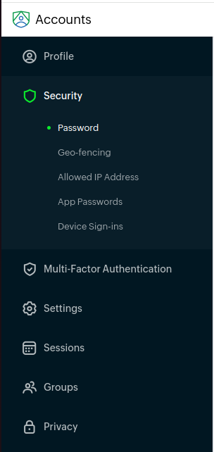
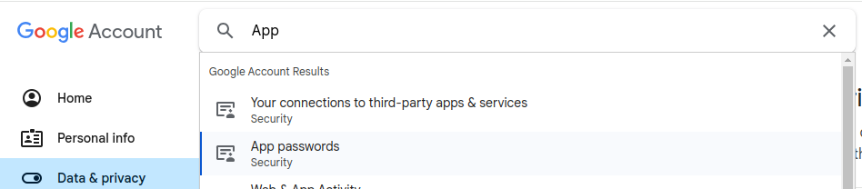

# Mail CLI Tool

A command-line interface (CLI) tool for managing email drafts, configuring SMTP settings, and sending emails.

## Table of Contents
- [Installation](#installation)
- [Usage](#usage)
  - [Setup Commands](#setup-commands)
  - [Draft Commands](#draft-commands)
- [Configuration](#configuration)
- [Draft Management](#draft)
- [App Password](#app-password)
  - [Zoho](#zoho)
  - [Google](#gmail)
- [License](#license)

## Installation

To use this CLI tool, you must have Node.js installed. Clone the repository and install the dependencies.

```
npx mail-cli
```

For installation inside node_modules
```
npm i mail-cli
```

For cloneing and contribution
```bash
git clone https://github.com/your-repo/mail-cli-tool.git
cd mail-cli-tool
npm install
```

## Usage

Run the CLI tool using the following command:

```bash
npx mail-cli <command> [options]
```

### Setup Commands

Configure the tool with your email settings and editor preferences.

```bash
npx mail-cli --setup --smtp-host <host>
npx mail-cli --setup --smtp-port <port>
npx mail-cli --setup --auth-user <username>
npx mail-cli --setup --auth-pass <password>
npx mail-cli --setup --set-secure
npx mail-cli --setup --set-unsecure
npx mail-cli --setup --set-editor <editor>
npx mail-cli --setup --view-config
npx mail-cli --setup --edit-config

```

### Draft Commands

Manage your email drafts with the following commands:

```bash
npx mail-cli --draft --new [--tag <tagname>]
npx mail-cli --draft --get-draft-list
npx mail-cli --draft --get-draft <draft_id or tag_name>
npx mail-cli --draft --edit-draft --subject <draft_id or tag_name> <new_subject>
npx mail-cli --draft --edit-draft --body <draft_id or tag_name> <new_body>
npx mail-cli --draft --send [<draft_id or tag_name>]

```

## Configuration

The configuration is stored in a config.json file. You can set up the following properties:

- **smtp-host**: SMTP server host.
- **smtp-port**: SMTP server port.
- **set-secure**: Boolean indicating if the connection should use SSL.
- **auth-user**: SMTP username.
- **auth-pass**: SMTP password.
- **editor-set**: Default editor for editing drafts.

## Draft

Drafts are stored in the VOLUMES/Drafts/ directory, and their metadata is maintained in the VOLUMES/drafts.json file. You can create, edit, and send drafts using the commands provided in the [Draft Commands](#draft-commands) section.

## App Password

### Zoho

- Use the following url in your browser
  ```
  https://accounts.zoho.in/home#profile/personal
  ```
- Go to **Account** Section in top left corner, and go to **Security** and **select Password** 

  

- Go to App Specific Password Section, and select **"Generate New Password"**

  

- Give a new App name, and select **Generate** to create a new Application


- A new **password** will be generated for the user

### Gmail

- **Open your Google Account** :
  and go to **search Bar**.

  

- **Search for App Passwords.**
  
  

- **create a new App Password**

  

## License

This project is licensed under the MIT License

```vbnet

### Notes:
- The structure of the `README.md` is designed to guide users through installing and using the CLI tool.
- The sections cover how to configure the SMTP settings, manage drafts, and access help within the tool.
- You should replace the placeholder repository URL in the installation instructions with the actual repository URL when deploying.

```